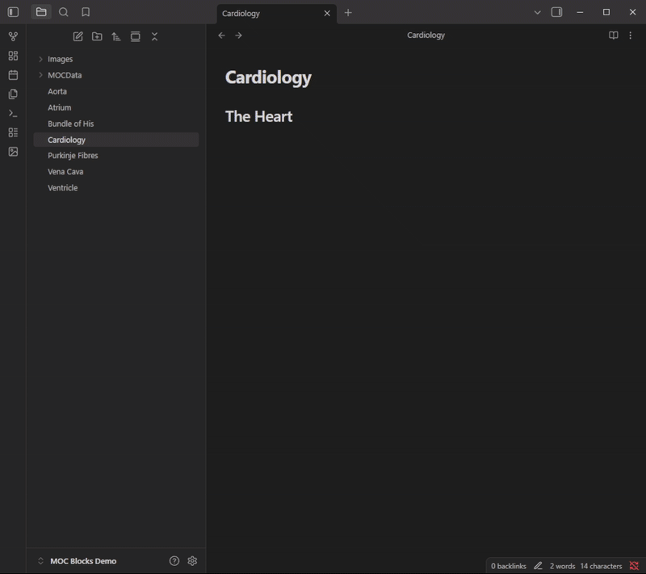
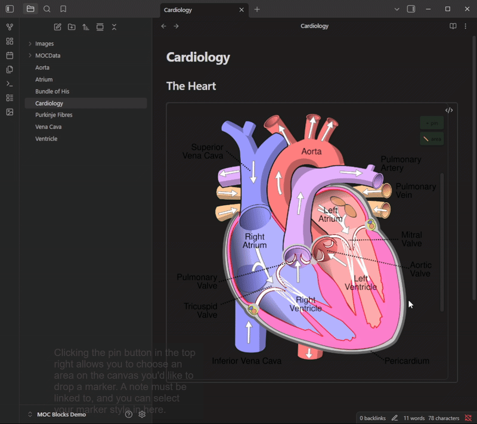
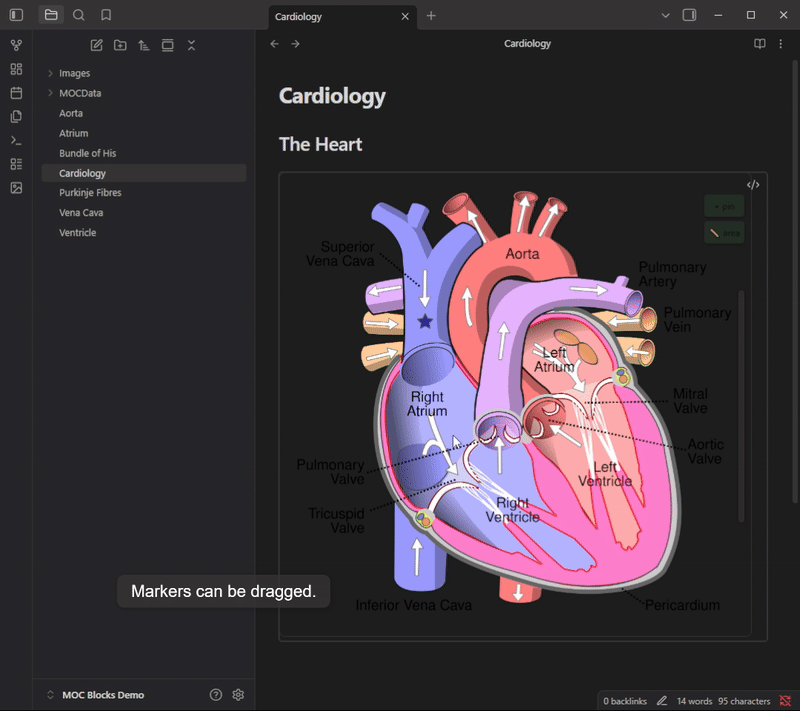
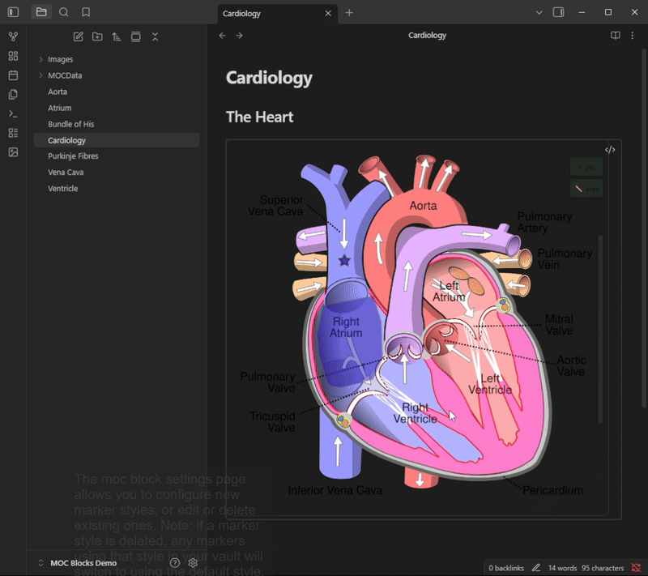

Any bugs, please report it on the [git repository](https://github.com/NebulousNessie/Obsidian-MOCBlocks-Dev/issues), thank you!

This is a plugin for creating simple Maps of Content, with a background image, using new 'MOC Block' code blocks.

---
## How the Plugin Works

### Adding a MOC Block


### Adding and Editing Markers


### Adding Polylines


### Configuring Marker Styles


---
## The Syntax
````markdown
``` moc
image: Image1.png
moc_id: [AUTOMATICALLY GENERATED]
image_width: [Image Px width, AUTOMATICALLY GENERATED]
```
````

Marker location and link data is saved in the moc_id file in your mocdata folder (in vault explorer).
> [!IMPORTANT]
> Note: If you delete any of these files, you will have lost that mocblock's data!

Marker Style data is stored in the plugin data.
> [!IMPORTANT]
> Marker Styles data will be deleted upon plugin deletion from your vault.
---

# Known issues

- For up-to-date issues, see the [Git repository](https://github.com/NebulousNessie/Obsidian-MOCBlocks)
- The [image converter](https://github.com/xryul/obsidian-image-converter) plugin breaks the MOC Block resizing feature.

---
# Inspiration

- This plugin is inspired in part by the excellent [leaflet](https://github.com/javalent/obsidian-leaflet) plugin, which allows a similar interface specific to maps. Check out that plugin to see if they have better features for your use case!

---
# Support

If you feel you would like to support my work (thank you!), please [buymeacoffee](https://buymeacoffee.com/nebulousnessie).
